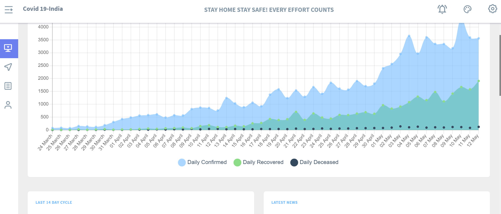
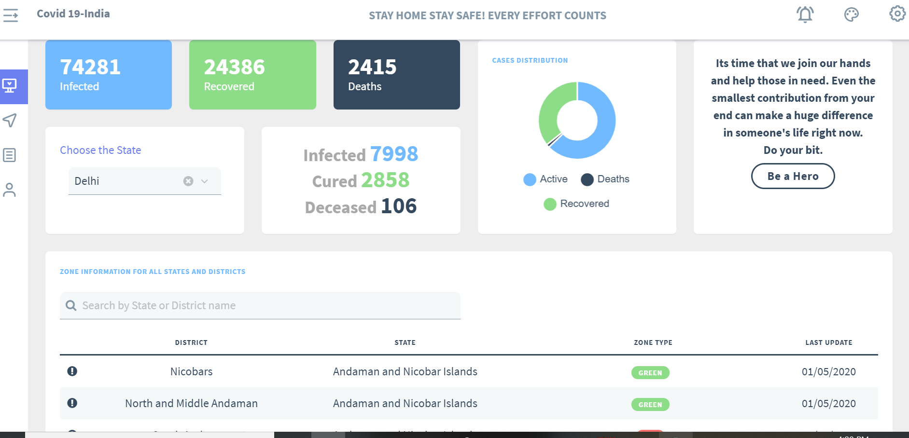
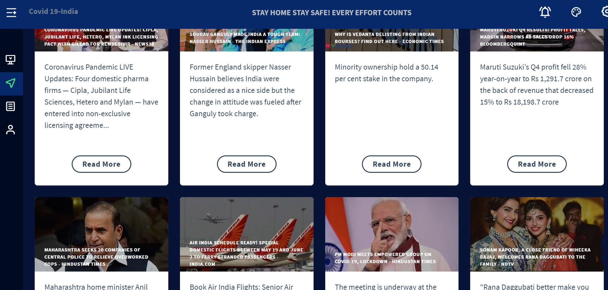
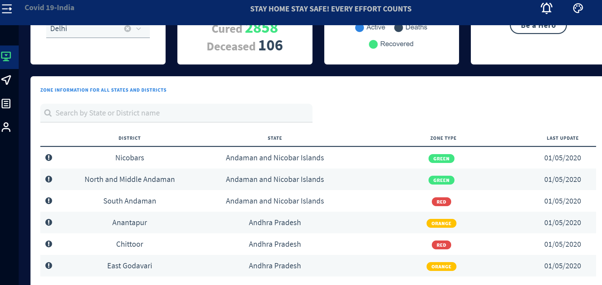

# Covid-19-Tracking APP 
# You can check it out on #
## http://databoard.in ##
### This is a web app deveoped to provide latest statistics and information about Covid-19 in India. 

This web app is developed using **VueJS and few of the online available APIs**. With this app you can- 
* See the **growth trends** since the first lockdown was imposed.
* Analyse the past **14 day cycle** of coronaravirus in India.
* Search for **state-wise statistics**.
* Get the **latest news** updates
* View the **zone wise distribution of states and districts**
* Get information about a few **donation funds available** to help those in need
* It also had a **light** and **dark** theme options to toggle between

### Here is how the tracker looks ###

**Overall Trends**

**State Wise Analysis**

**News Board**

**Zone Wise Information**

APIs used in the project are- 
* https://api.covid19india.org/data.json
* https://newsapi.org/v2/top-headlines?country=in&apiKey=356935d6851d401c91472e093d263ac3
* https://api.rootnet.in/covid19-in/stats/latest

I'll keep on adding **features and modules** to this tracker to make it more informative and useful. 

For any query or suggestion, please feel free to mail them at saiyamjain0012@gmail.com. Do check out http://databoard.in and please star this repository if you like it. 

